# Profiling and Performance Tuning

## Objectives

After completing this lab, you will be able to:

* Setup the platform for profiling an application
* Set the necessary compiler directive on an application to enable profiling
* Setup the profiling parameters
* Profile an application and analyze the output

## Steps
## Create a Vivado Project
### Launch Vivado and create an empty project
1. Open Vivado and create a new project new project called **lab9** in the **{labs}** directory.
1. Select the **RTL Project** option in the _Project Type_ form, and click **Next**.
1. Select **Verilog** as the _Target Language_ in the _Add Sources_ form, and click **Next**.
1. Click **Next** two times.
1. In the _Default Part_ form, search and select **pynq-z2**, and click **Next**.
1. Click **Finish** to create an empty Vivado project.

### Set the project settings to include provided fir\_top IP
1. Click **Settings** in the _Flow Navigator_ pane.
1. Expand **IP** in the left pane of the _Project Settings_ form.
1. Click Repository and using &quot;minus&quot; button remove entries, if any.
1. Click on the **Add** button, browse to **{sources}\lab9** and click **Select**.
1. Click **OK**.

    > The directory will be scanned and it will report one IP was detected.

1. Click **OK** twice.
## Creating the Hardware System Using IP Integrator
### Generate the Zynq ARM Cortex-A9 processor based hardware system.
1. In the Flow Navigator, click **Create Block Design** under IP Integrator.
1. Name the block **system** and click **OK**.
1. Click on the **Add IP** button, search for **zynq** and double click on **ZYNQ7 Processing System** to add it to the design.
1. Click on **Run Block Automation**, and click **OK** to accept the default settings.
1. Double click on the Zynq block to open the _Customization_ window for the Zynq processing system.

### Configure the I/O Peripherals block to only have UART 0 support.
1. Click on the _MIO Configuration_ panel to open its configuration form.
1. Expand the _I/O Peripherals_ on the right.
1. Uncheck _ENET 0_, _USB 0_, and _SD 0_, _GPIO (GPIO MIO)_, leaving _UART 0_ selected.
1. Click **OK**.

    

    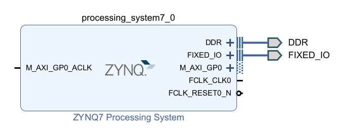
    

    

    <i>ZYNQ Processing System configured block</i>
    

## Add FIR Core to the System
### Instantiate the provided FIR core twice
1. Click the **Add IP** button and search for **fir** in the catalog.
1. Double-click on the **fir_top_v1_0** to add the IP instance to the system.
1. Select the _fir\_top\_1_ instance and change its name to **fir_left** in its property form.
1. Add another **fir_top_v1_0** IP and rename it to **fir_right**.
1. Click on **Run Connection Automation** , and select **All Automation** to select _fir\_left_ and _fir\_right_ **.**
1. Click on _s\_axi\_fir\_io_ for both _fir\_left_ and _fir\_right_ and confirm that they will be automatically connected to the Zynq _M\_AXI\_GP0_ port
1. Click **OK** toconnect the two blocks to the _M\_AXI\_GP0_. The design should look similar to shown below:

    

    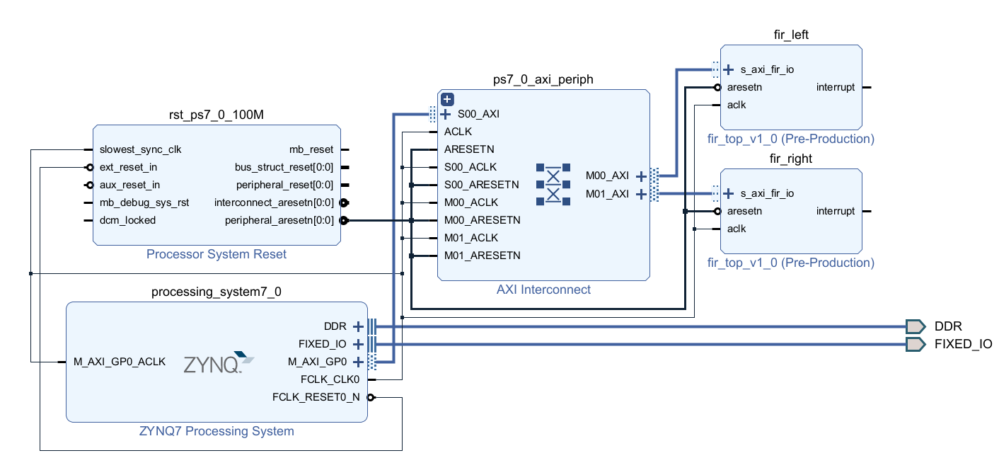
    

    

    <i>The completed design</i>
    

    >It is not necessary to connect the _interrupt_ signals of the _fir_ blocks.

1. Click on the **Validate Design (F6)** button to make sure that there are no errors.

    >Ignore warnings.

## Generate the Bitstream
1. In Vivado, select the _Sources_ tab, expand the _Design Sources,_ right-click the _system.bd_ and select **Create HDL Wrapper** and click **OK**.
1. Click on the **Generate Bitstream** in the _Flow Navigator_ pane to synthesize and implement the design, and generate the bitstream.
1. Click **Save** to save the design and **Yes** to run the necessary processes. Click **OK** to launch the runs.
1. When the bitstream generation process has completed click **Cancel.**

## Export the Design to Vitis
1. Export the hardware configuration by clicking **File > Export > Export Hardware…**
1. Tick the box to _Include Bitstream_, and click **OK**
1. Launch Vitis IDE by clicking **Tools > Launch Vitis IDE** and click **OK**
1. Close any other opened system projects by right-clicking on the system project, and select **Close System Project**.
1. Select **File > New > Platform Project...**
1. Enter **lab9_platform** for the _Platform project name_.
1. Select the tag **Create a new platform from hardware (XSA)**, and click on **Browse** button to select the exported .xsa file (in **{labs}\lab9** directory). Click **Finish**.
1. Expand **lab9_platform** in _Explorer_ view, and double-click on **platform.spr** to open the settings.
1. Click on **standalone on ps7_cortexa9_0 > Board Support Package** in the left, and click on **Modify BSP Settings...** in the right.
    

    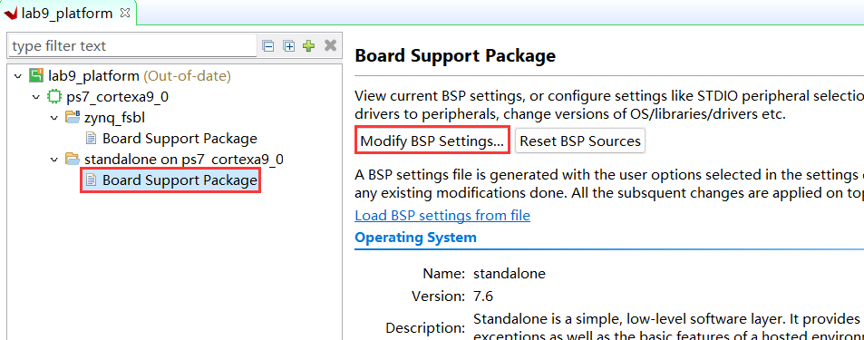
    

    

    <i>Enable profiling in the board support package</i>
    

1. Select the **Overview &gt; standalone** entry in the left pane, click on the drop-down arrow of the _enable\_sw\_intrusive\_profiling_ **Value** field and select **true**.

    

    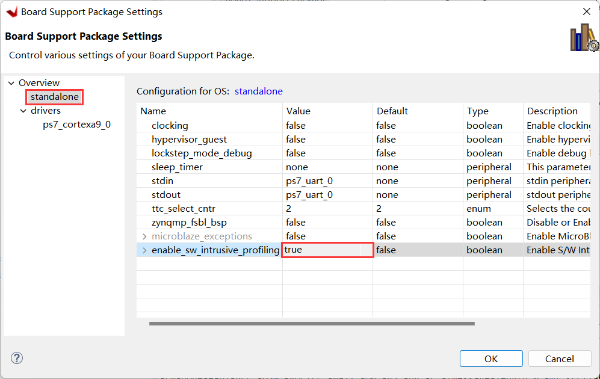
    

    

    <i>Enable profiling in the board support package</i>
    

1. Select the **Overview &gt; drivers &gt; ps7\_cortexa9_0** and add **–pg** in the _extra\_compiler\_flags_ **Value** field.

    

    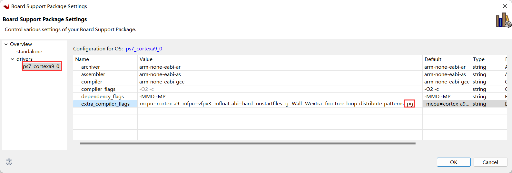
    

    

    <i>Adding profiling switch</i>
    

1. Click **OK** to accept the settings.
1. Build the platform project by clicking the **Hammer** button or right-clicking **lab9_platform** in the _Explorer_ view and select **Build Project**.

## Create the Application
1. Select **File** &gt; **New** &gt; **Application Project.**
1. Click on the tag **Select a platform from repository**, and select **lab9_platform**. Click **Next**.
1. Enter **lab9** as the project name, and click **Next** two times.
1. Select **Empty Application (C)** in the _Templates_ window and click **Finish**.
1. In the _lab9_ project, right click on the _src_ directory and select **Import Sources...**
1. Browse to open the **{sources}\lab9** directory.
1. Select **fir\_coef.dat, fir.c, fir.h, lab9.c, lab9.h,** and **xfir\_fir\_io.h,** and click **Finish.**
1. Open the _lab9.c_ file and scroll to the main function at the bottom. Notice the following code:

    

    
    

    

    <i>Source code snippet</i>
    

     The function _fir\_software_( ) function is a software implementation of the FIR function. The _filter\_hw\_accel\_input_( ) function offloads the FIR function to the two FIR blocks that have been implemented in the PL.

## Run the Application and Profile
### Run the application using the user defined SW_PROFILE symbol.
1. Place the board in the JTAG boot up mode.
1. Power ON the board.
1. Right click on the **lab9** project, and select **C/C++ Build Settings**.
1. Under the **ARM v7 gcc compiler** group, select the **Symbols** sub-group **,** click on the **Add** button to open the value entry form, enter **SW\_PROFILE** , and click **OK**.
    

    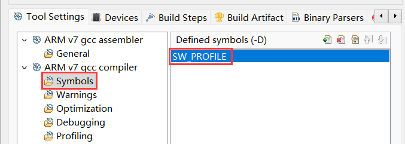
    

    

    <i>Add user-defined symbol</i>
    

    >This will allow us to profile the software loop of the FIR application.

1. Under the **ARM v7 gcc compiler** group, select the **Profiling** sub-group, then check the **Enable Profiling** box.
    

    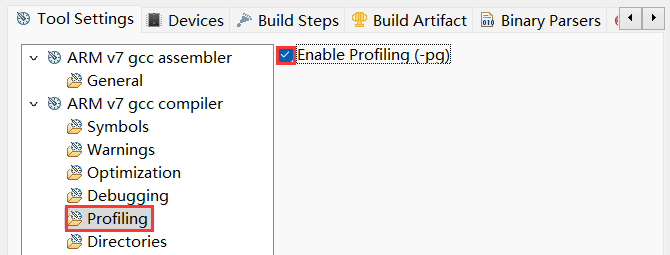
    

    

    <i>Compiler setting for enabling profiling</i>
    

1. Click **Apply and close**, and click **OK**.
1. Build the project by clicking the **Hammer** button
1. Right-click on **lab9** in _Explorer_ view, and select **Run as > Run Configurations...**
1. Right-click on **Single Application Debug** and select **New Configuration**.
1. Click on the newly created **Debugger_lab9-Default** configuration, and select the **Application** tab.
1. Click on the _Advance Options_ **Edit…** button.
1. Check the **Enable Profiling (gprof)** box, enter **100000** (100 kHz) in the Sampling Frequency field, enter **0x10000000** in the scratch memory address field, and click **OK**.
    

    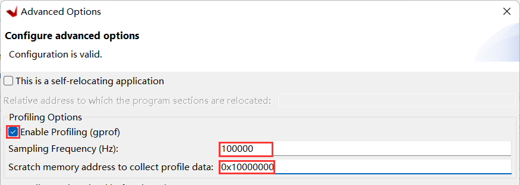
    

    

    <i>Profiling options</i>
    

1. Click **Apply** and then click the **Run** button to download the application and execute it.

    The program will run.

### Analyze the results.
1. When execution is completed, the Gmon File Viewer dialog box will appear showing _lab6.elf_ as the corresponding binary file.  Click **OK**.
1. Click on the **Sort samples per function** button ().
1. Click in the **%Time** column to sort in the descending order.
    

    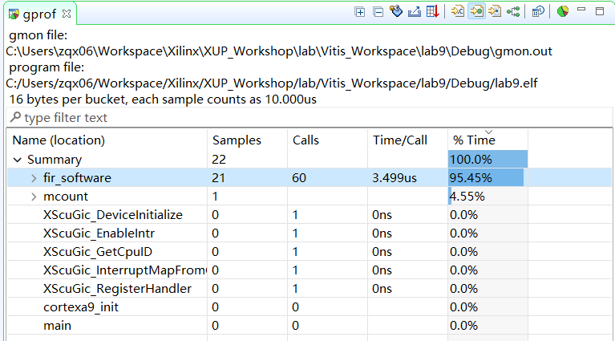
    

    

    <i>Sorting results</i>
    

    > Note that the fir\_software routine is called 60 times, 22 samples were taken during the profiling, and on an average of 3.5 microseconds were spent per call.

1. Go back to the _Run Configuration_, and change the sampling frequency to **1000000** (1 MHz) and profile the application again.
1. When execution is completed, click **OK** and the gprof viewer will be updated.
1. Invoke **gprof** , select the **Sorts samples per function** output, and sort the **%Time** column.
    

    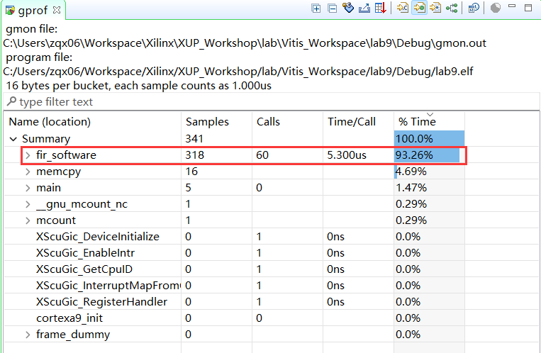
    

    

    <i>Profiled results with 1 MHz sampling frequency</i>
    

    > Notice that the output has better resolution and reports more functions and more samples per function calls. Note that the number of calls to the fir\_software function has not changed but the number of samples taken increased, and the average time spent per call is 5.3 microseconds in the figure below. At this stage, the designer of the system would decide if the FIR function should be ported to hardware.

### Profile the application using the hardware FIR filter IP
1. Select the **lab9** project, right-click, and select **C/C++ Build Settings**.
1. Under the **ARM v7 gcc compiler** group, select the **Symbols** sub-group **,** select **SW\_PROFILE** , and delete it by clicking on the delete button.

    >This will allow us to profile the hardware IP of the FIR application.
1. Click **Apply and Close** , and then click **OK**.
1. Build the project by clicking on the **Hammer** button.
1. Click **Run as &gt; Run Configurations** and select **Debugger_lab9-Default**, click the **Run** button to profile the application again (click OK to relaunch) and click **OK** when profiling completes.
    

    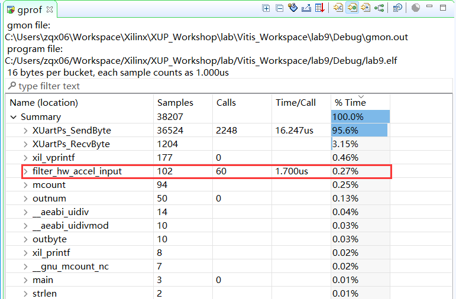
    

    

    <i>Profiled results with 1 MHz sampling frequency</i>
    

    >Notice that the output now shows filter\_hw\_accel\_input function call instead of the fir\_software function call. Note that the average time spent per call is much less as the filtering is done in the hardware instead of the software.

1. Close the Vitis IDE and Vivado programs.
1. Turn OFF the power on the board.

## Conclusion

This lab led you through enabling the platform and the application settings for the profiling. You went through creating the hardware which included the hardware IP and was later profiled in the application. You analyzed the profiled application output.